```{r setup, include=FALSE}
knitr::opts_chunk$set(echo = TRUE)
```

## What you will need
1. Git ... since the Hack Oregon repositories live on GitHub, install the GitHub Desktop from <https://desktop.github.com/>.
2. If you need to capture screenshots, install Sizer (<http://www.brianapps.net/sizer/>) and Greenshot (<http://getgreenshot.org/>). I captured the screenshots for this tutorial with them.

Open source installation on Windows can be frustrating. The developers try their best to make things easy, but you may still find it frustrating. Please, do yourself a favor and read through all of the instructions below once before you start going to websites, downloading packages and installing them.

## Miniconda
Download the installer at <http://conda.pydata.org/miniconda.html>. The 64-bit installer is at <https://repo.continuum.io/miniconda/Miniconda3-latest-Windows-x86_64.exe> and the 32-bit installer is at <https://repo.continuum.io/miniconda/Miniconda3-latest-Windows-x86.exe>. Double-click the installer to start it.

1. On this screen, just press 'Next'.

    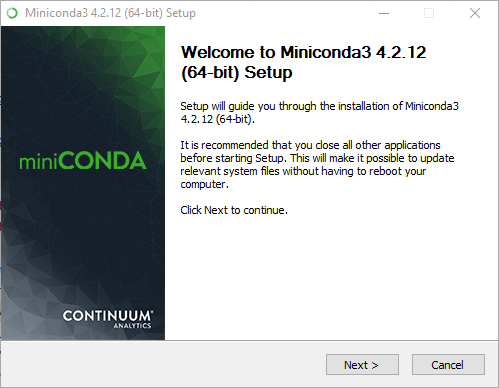
1. Press 'I Agree' to accept the license.

    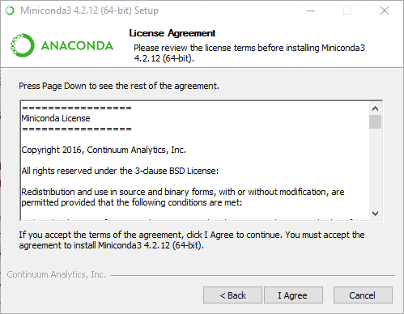
1. Select 'Just me' and press 'Next'.

    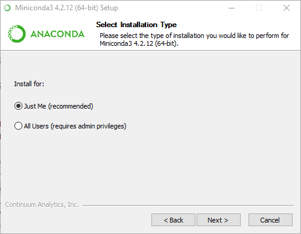
1. Accept the default install location and press 'Next',

    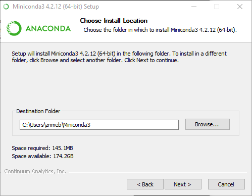
1. Make sure both options are checked and press 'Install'.

    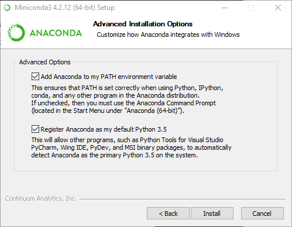
1. Install complete - press 'Next',

    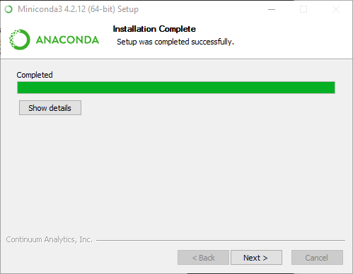
1. Thanks screen - clear the Anaconda Cloud checkbox and press 'Finish'.

    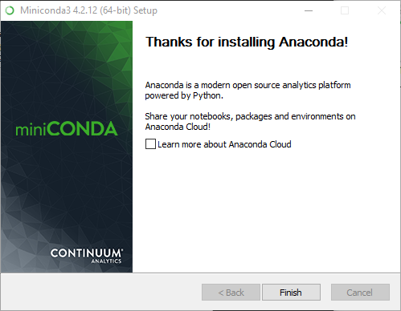
1. Find the 'Anaconda Prompt' entry in your Windows start menu. Open it and enter `conda update --yes --all`. This will download and install the latest packages.

    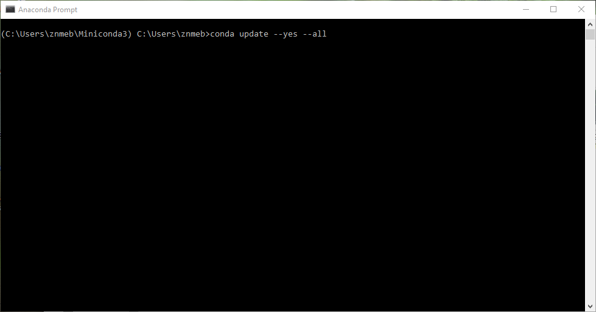
1. Enter `conda create -n data-science jupyter scikit-learn seaborn statsmodels django` to create the  data-science Conda environment and install the packages listed in it. Anaconda will add buttons to your Windows start buttons for `data-science`.

    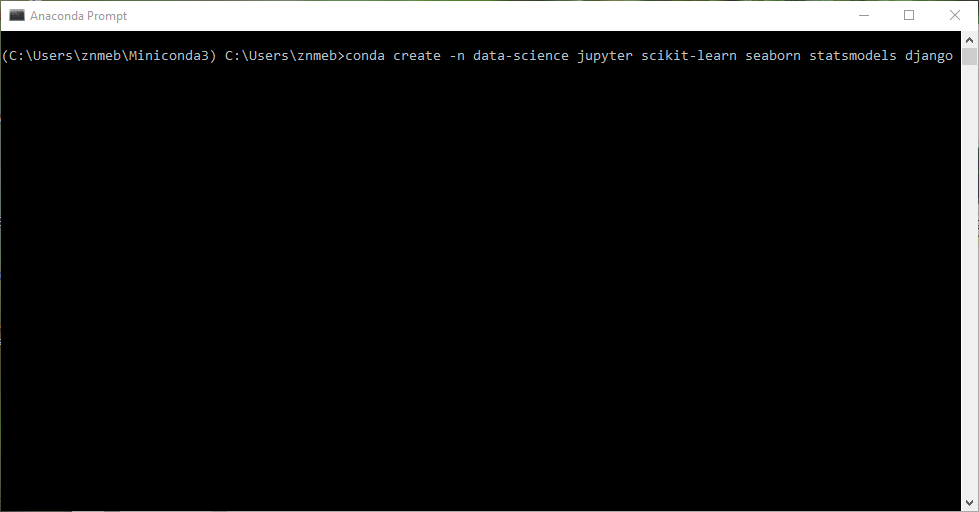
1. Enter `activate data-science` and `pip install djangorestframework` to install the Django Rest Framework.

    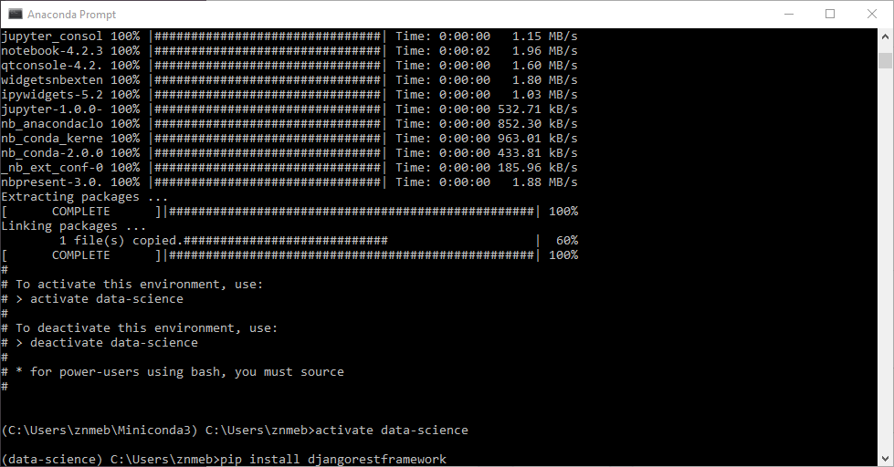
1. Enter `deactivate-data-science` and close the window.

    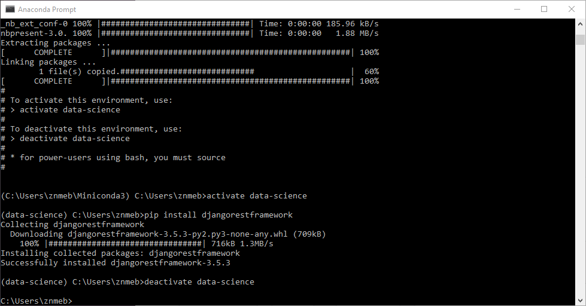

## PostgreSQL
1. Go to <http://www.enterprisedb.com/downloads/postgres-postgresql-downloads> and download the installer. ***Make sure you get the 9.5 release; that's what the Database Engineering class is using.***

    Download links:
    
    * 64-bit Windows: <http://www.enterprisedb.com/postgresql-955-installers-win64>
    * 32-bit Windows: <http://www.enterprisedb.com/postgresql-955-installers-win32>
    * MacOS: <http://www.enterprisedb.com/postgresql-955-installers-osx>

1. Double-click the installer. You'll need to authorize the install, then after a few operations you'll get this screen. Press "Next".

    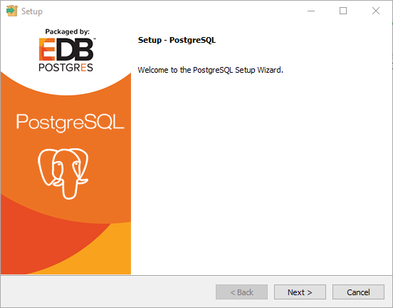
1. Accept the default install location on this screen with "Next".

    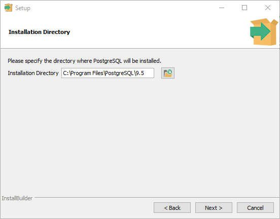
1. Accept the default data directory on this screen with "Next".

    
1. ***This screen is important! Here you will set the password for the PostgreSQL super-user, named "postgres". As usual, you need a strong password, something easy for you to remember and impossible for anyone else to figure out. Enter your password twice and press "Next".***

    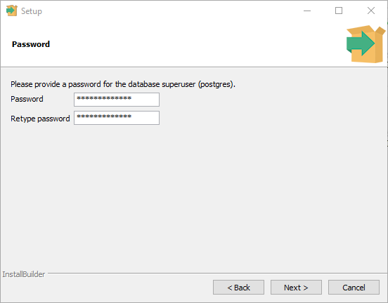
1. On the "Port" screen, accept the default port, usually "5432", with "Next".

    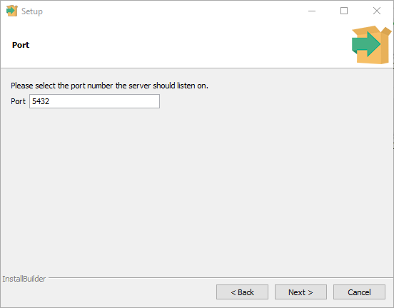
1. On the "Advanced Options" screen, accept the default locale with "Next".

    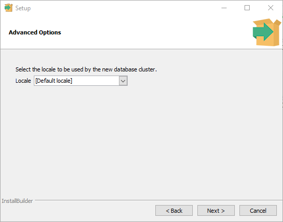
1. Press "Next" on the "Ready to Install" screen to install PostgreSQL.

    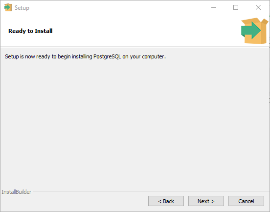
1. When the PostgreSQL install is done, you'll get this screen. Make sure the Stack Builder checkbox is cleared and press "Finish".

    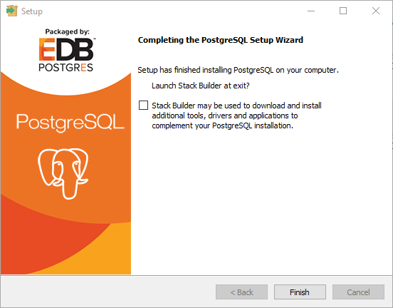

## PostGIS
The EnterpriseDB installer you just ran added some tools to your menu. Among these is Stack Builder, which you'll use to install PostGIS. Start Stack Builder now.

1. This is the first screen you'll get from Stack Builder. Pull down the drop-down and select the PostgreSQL database you just installed. Then press "Next".

    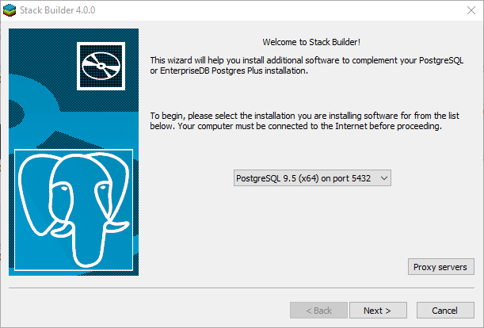
1. You will get a screen with a menu of available add-ons. Expand the "Spatial Extensions" item with the plus sign. Choose PostGIS 2.2. Choose 32-bit or 64-bit depending on whether you installed 32-bit or 64-bit PostgreSQL. In my case, it was 64-bit. Then press "Next".

    Note that Stack Builder is not very tidy about whether it's actually done the PostGIS install. Under some circumstances it will think it did when it only downloaded the installer. So always select the PostGIS option even if you installed it before.

    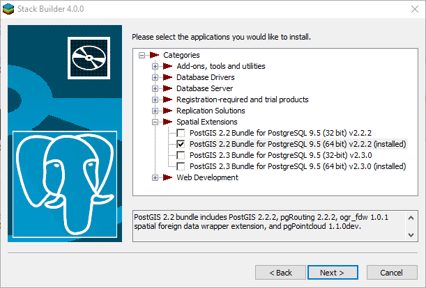
1. On the review screen, accept the default download location and press "Next". This will download the installer for PostGIS.

    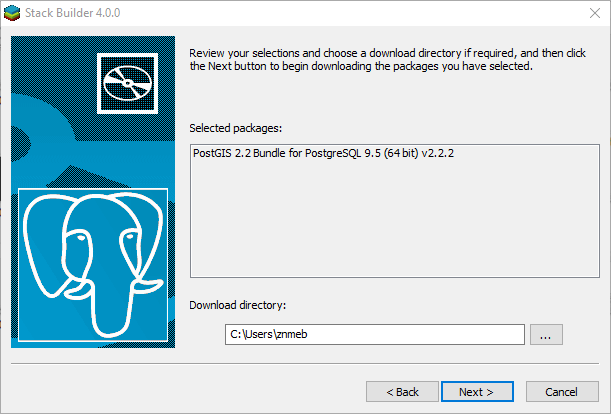
1. When the download is finished, you'll get this screen. Make sure the "Skip Installation" checkbox is ***cleared*** and press "Next". This will start the PostGIS installer.

    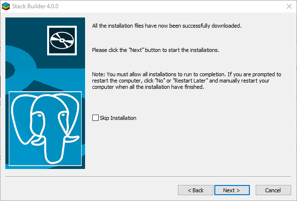
1. On this screen, press "I Agree" to accept the license.

    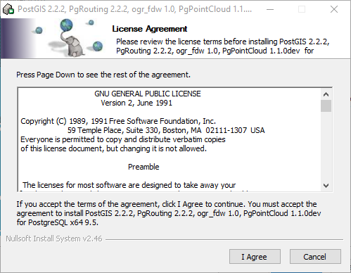
1. On the "Choose Components" screen, make sure PostGIS is checked and "Create spatial database" is cleared. Then press "Next".

    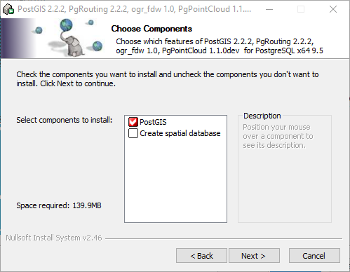
1. On the "Choose Install Location", accept the default with "Next".

    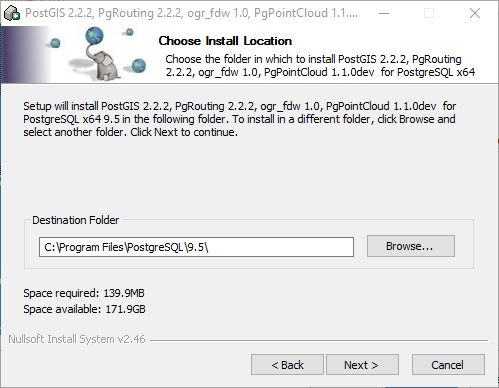
1. When you get this "GDAL_DATA" question, answer "Yes".

    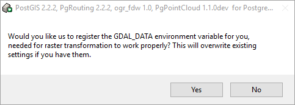
1. When you get this "raster drivers" question, answer "Yes".

    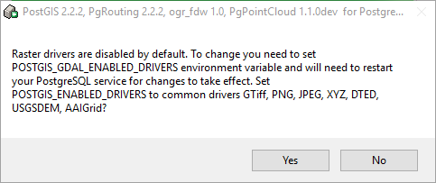
1. When you get this "raster out of db" question, answer "Yes".

    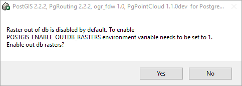
1. When you get this "Installation Complete" screen, press "Close".

    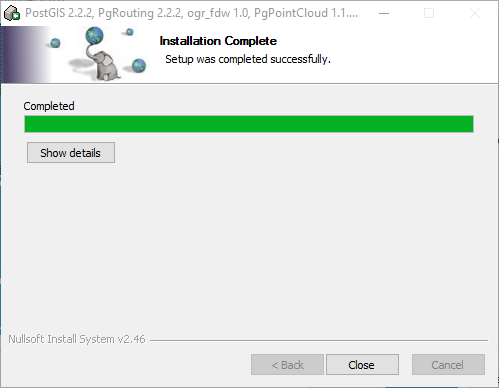
1. Now you'll get an "Installation Completed" screen from Stack Builder. Press "Finish".

    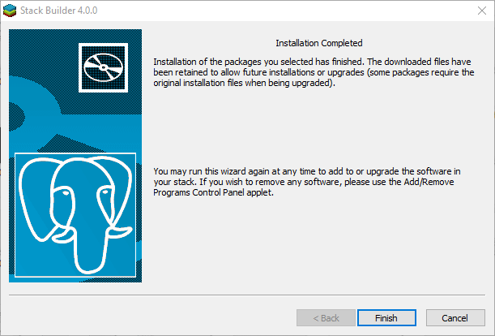

## QGIS (Quantum GIS)
The QGIS download site is <http://www.qgis.org/en/site/forusers/download.html>. For 64-bit Windows, download <http://qgis.org/downloads/QGIS-OSGeo4W-2.18.0-1-Setup-x86_64.exe>. For 32-bit Windows download <http://qgis.org/downloads/QGIS-OSGeo4W-2.18.0-1-Setup-x86.exe>. Double-click the installer to start it. 

1. This is the welcome screen. Press "Next".

    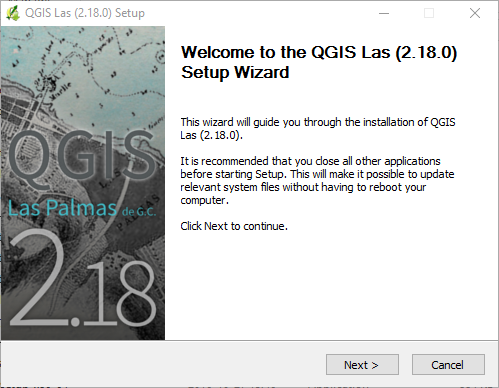
1. Press "I Agree" to accept the license agreement.

    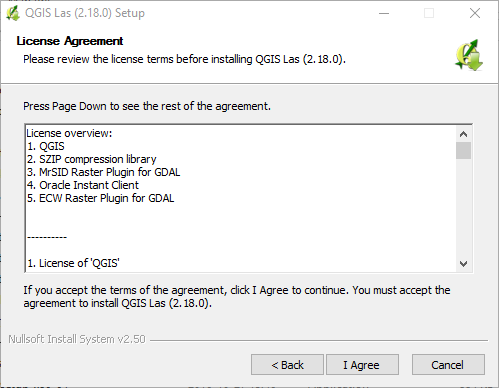
1. Accept the default location and press "Next".

    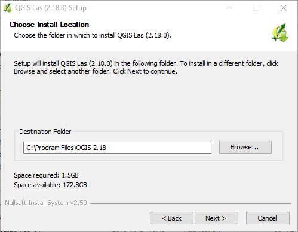
1. Just choose "QGIS" and press "Install".

    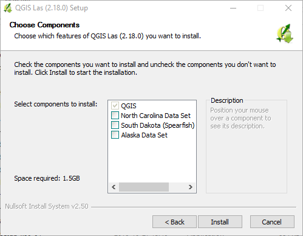
1. Press "Finish" when the install has finished.

    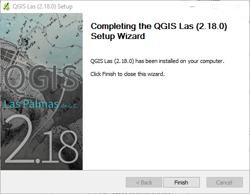
