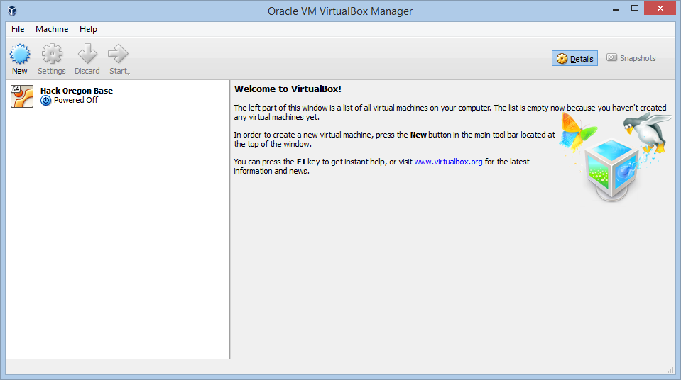
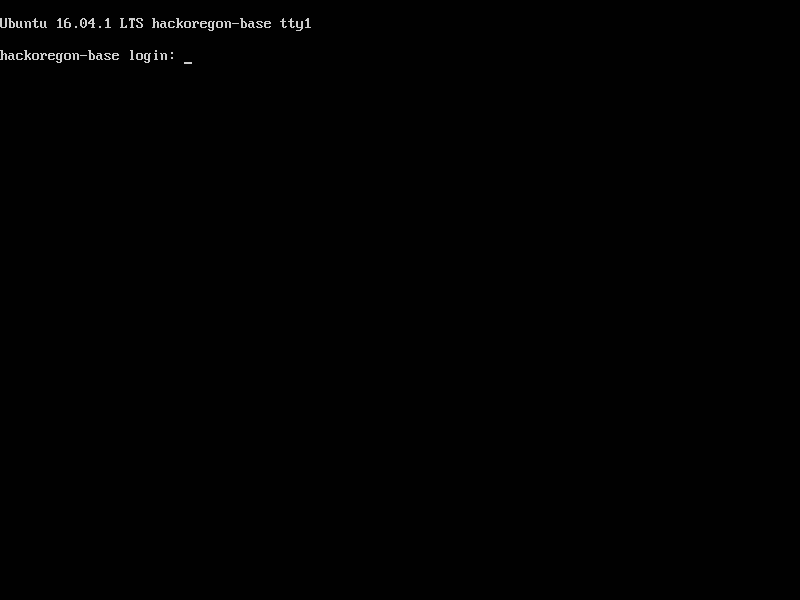

These are the instructions for installing and using the Hack Oregon Base instance (HackOregonBase.ova file) to install and use a python interpreter (miniconda), jupyter notebook, and a postgres server.

To use the Hack Oregon Base virtual box, it's necessary to first install the Virtual Box software on your operating system.   

1.  #### [Download and install the appropriate version of VirtualBox](https://www.virtualbox.org/wiki/Downloads)

2.  Download the Hack Oregon Base OVA file.   This file is ~4gb in size and is available via Google Drive [here](https://drive.google.com/open?id=0B2VTjTSmFU2lWnJUQTR3T3NQdTg).   Note that if possible, it would be best to get this file off of a thumb drive or some other non-network source, as it will take a very long time to download on slow or congested networks.

3.  Start Oracle Virtual Box application.   

4.  Choose File->Import Appliance... menu.   Navigate to where the HackOregonBase.ova was downloaded to and import it.

5.   Once complete, the following should result

6.  Select the Hack Oregon Base box, and click on the Start button.  This will open a separate window, start the Ubuntu OS, resulting in the following

